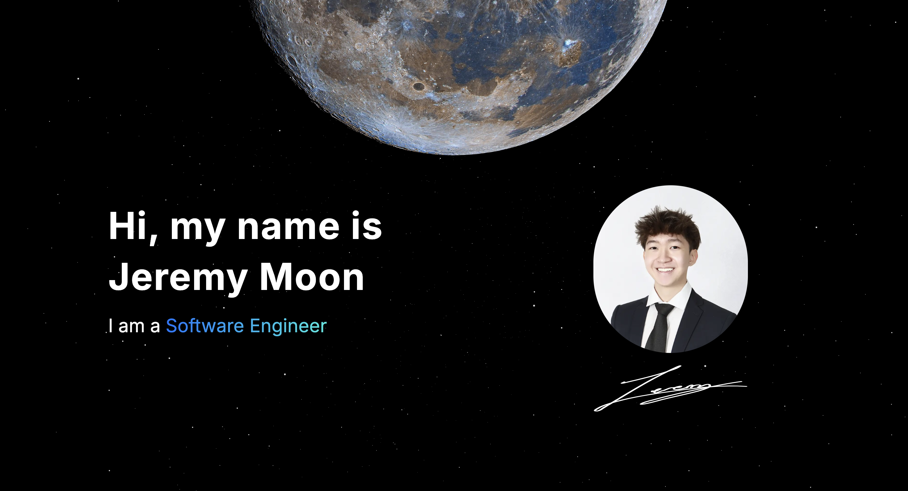

  

<h1 align="center">
  jeremymoon.dev
</h1>

  

Hello and welcome to my portfolio website! My name is Jeremy Moon, and I am a student at the University of Michigan studying Data Science. Thank you for taking the time to visit my website and learn more about my education, projects, and skills!

## ⭐ Features
- ⚡️ Next.js 14 with App Router
- 🎨 Tailwind CSS - for modern styling
- 🃏 Aceternity UI - accessible UI components
- 🛡 Strict TypeScript and ESLint configuration
- 📱 Fully Responsive
- 🎨 Animation - using Framer Motion
- 🌎 3D Globe
- 🖼️ Autoplay Image Carousel
- 📇 Interactive Project Cards
- ⏱️ REST API routing with Wakatime API
- 

## ✍🏻 Author

- [@jere67](https://github.com/jere67)

## 🪪 License

Please do not deploy this directly to production. It is not a template and is not intended to be used as one.

This project is open source and available under the [GPL3 License](LICENSE).

## 🤖 Changes to Make
- External About + Project Pages
- Tracing Beam
- Sentry
- Integrate Spotify API